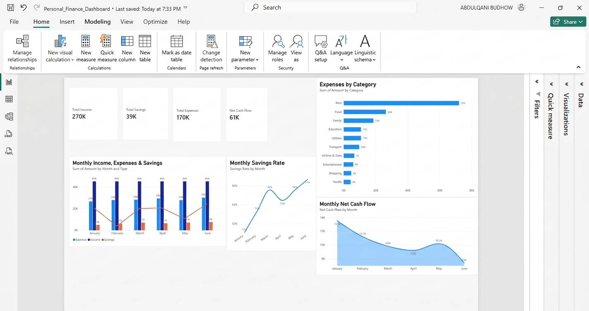
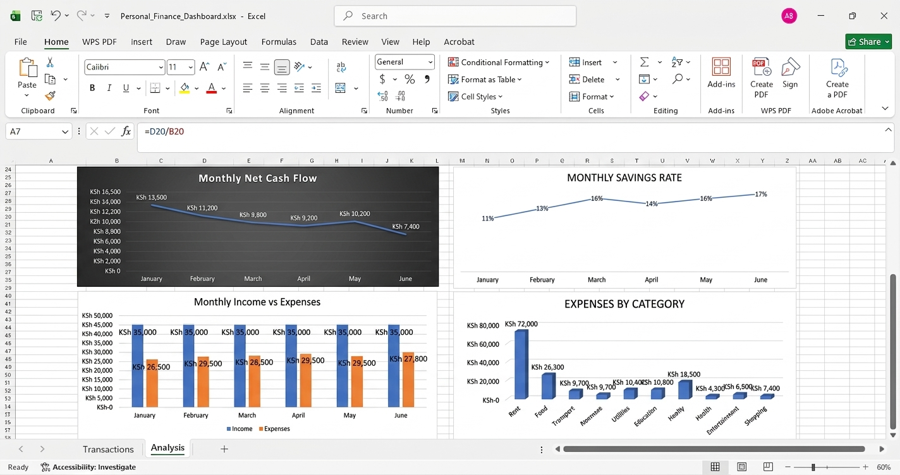

## Dashboard Preview

### Power BI Dashboard

### Excel Dashboard

# Personal Finance Dashboard

A personal finance analysis project built using Excel and Microsoft Power BI. The project analyzes six months of income, expenses, savings, and cash flow from January to June 2026.

## Project Objective

The objective of this project was to transform raw financial transactions into meaningful financial insights and an interactive dashboard.

The project follows this workflow:

**Raw Data → Excel Analysis → Power BI Dashboard → Financial Insights**

## Tools Used

- Microsoft Excel
- Microsoft Power BI
- DAX
- GitHub

## Key Metrics

- Total Income: KSh 270,000
- Total Expenses: KSh 169,700
- Total Savings: KSh 39,000
- Net Cash Flow: KSh 61,300
- Overall Savings Rate: 14%

## Dashboard Analysis

The Power BI dashboard provides analysis of:

- Monthly income, expenses, and savings
- Monthly net cash flow
- Expenses by category
- Monthly savings rate
- Overall financial KPIs

## Key Financial Insights

- Monthly income remained constant at KSh 45,000.
- Expenses increased from KSh 26,500 in January to KSh 30,100 in June.
- Monthly savings increased from KSh 5,000 to KSh 7,500.
- Savings rate improved from 11% in January to 17% in June.
- Net cash flow declined from KSh 13,500 in January to KSh 7,400 in June.
- Rent was the largest expense category, accounting for approximately 42% of total expenses.

## Dataset

The dataset is fictional and was created specifically for educational and portfolio purposes. It does not contain real personal financial information.

## Files

- `Personal_Finance_Dashboard.xlsx` — Excel transaction data and financial analysis.
- `Personal_Finance_Dashboard.pbix` — Interactive Power BI dashboard.

## Skills Demonstrated

- Financial analysis
- Excel formulas and data organization
- Data visualization
- Power BI dashboard development
- DAX measures
- Business insight generation
- Communicating financial findings

## Conclusion

This project demonstrates the process of turning raw financial transaction data into financial metrics, visual analysis, and actionable insights using Excel and Power BI.
